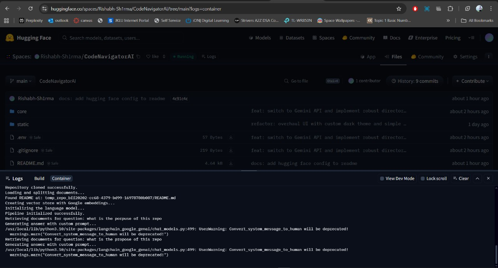

# CodeNavigator AI 🧭 - Nervesparks Developer Assessment

This project is my implementation of a Retrieval-Augmented Generation (RAG) system designed to chat with any public GitHub repository. I built this to demonstrate a full-stack approach to creating modern AI applications, focusing on robust backend logic and a polished, professional user experience.

---

### 🎥 Live Demo & Video Walkthrough

I recorded a short video to walk you through the project's architecture, my key technical decisions, and a live demonstration of the app. I highly recommend giving it a watch!

➡️ **[Watch the Video Walkthrough Here (Link to Loom or YouTube)]** ⬅️

You can also interact with the live, deployed application yourself:

🚀 **[Try the Live Application Here](https://huggingface.co/spaces/Rishabh-Sh1rma/CodeNavigatorAI)** 🚀

---

### ✨ Key Features

-   **Dynamic GitHub Repository Ingestion:** Accepts any public GitHub repository URL as a data source.
-   **Intelligent Document Processing:** Parses relevant source code and docs while smartly ignoring noisy files (like `package-lock.json`) to improve accuracy.
-   **Prioritized Context with README:** Always uses the `README.md` as the primary context for high-level questions, ensuring the most relevant answers.
-   **Context-Aware Q&A:** Leverages a RAG pipeline with **Google's Gemini 1.5 Flash** model for technically accurate answers.
-   **Polished Custom UI:** A professional and responsive UI built with Streamlit and custom CSS for a great user experience.

---

### 📖 How This RAG System Works

I designed the architecture to be a classic, effective RAG pipeline. Here’s a step-by-step breakdown of how it functions, from input to answer:

 
*(**Instruction:** You'll need to upload the diagram image to a service like Imgur and paste the direct image link here.)*

1.  **Ingestion & Processing (The "Large Corpus"):** The process starts when a user provides a GitHub URL. My application clones the entire repository locally.
2.  **Chunking & Embedding:** I wrote a parser that intelligently walks through the repository, ignoring irrelevant files. It reads the content of valid source code and documentation files and breaks them down into smaller, meaningful "chunks." Each chunk is then converted into a numerical representation (an embedding) using a Google AI model.
3.  **Vector Database (The "Knowledge Base"):** These embeddings are stored and indexed in a ChromaDB vector database. This database acts as the long-term memory or "knowledge base" for the repository's content.
4.  **The Chat Loop (Retrieval & Generation):**
    * **User Query:** When a user asks a question, their query is also converted into an embedding.
    * **Semantic Search:** The system performs a similarity search in the vector database to find the chunks of text whose embeddings are most semantically similar to the user's question. This is the **retrieval** part.
    * **Context Injection:** The retrieved text chunks, along with the content of the `README.md` for overall context, are injected into a carefully crafted prompt.
    * **LLM Response:** This combined prompt is sent to the Gemini LLM, which **generates** a human-like answer based *only* on the context it was given.

---

### 💪 Challenges I Faced & How I Solved Them

Building this project involved tackling several real-world engineering problems. Here are a few highlights:

-   **Challenge: Persistent File-Locking on Windows:** My initial approach of deleting and reusing a temporary folder (`temp_repo`) kept failing with `Access is denied` errors on Windows. The system's Git process was holding a lock on the files, preventing cleanup.
    -   **Solution:** I re-architected the file handling logic. Instead of reusing one folder, the application now generates a **unique directory** (using UUIDs) for each new repository analysis. This completely bypasses the file-locking issue, making the application far more robust.

-   **Challenge: Poor Initial Retrieval Quality:** My first RAG implementation gave strange, irrelevant answers. I found that it was retrieving context from noisy files like `package-lock.json` and CSS files instead of important ones like the `README.md`.
    -   **Solution:** I implemented a two-part fix. First, I added an **ignore list** to the document loader to filter out common noisy files and directories. Second, I re-wrote the final prompt injection step to **always prioritize and include the full content of the `README.md`**, ensuring the AI always has the high-level project summary.

-   **Challenge: Outdated API Models:** During development, I started getting `404 Not Found` errors from the AI model.
    -   **Solution:** I researched the latest Google AI API documentation and found that the model name `gemini-pro` had been succeeded by newer versions. I updated the code to use `gemini-1.5-flash-latest`, which not only fixed the error but also improved the application's speed and capabilities.

---

### 📸 Screenshots

Here are some screenshots of the application in action.


*A view of the main user interface.*


*Image Representing Codebase.*


*A view of HuggingFace space folder and build logs .*

---

### 🚀 My Credentials & Portfolio

-   [**LinkedIn**](https://www.linkedin.com/in/rishabh-sharma25/)
-   [**Portfolio**](https://marvelous-presentations-488852.framer.app/)
-   [**GitHub**](https://github.com/Rishabh-Sh1rma)
-   [**Email**](mailto:rishabhar1974@gmail.com)

---

### 💡 More of My Work

-   **Project 1: RAG QA ChatBot**
    -   *Description:* A chatbot that answers questions from documents using a RAG pipeline with FastAPI, FAISS, and React.
    -   *Link:* `https://github.com/Rishabh-Sh1rma/Retrieval-Augmented-Generation--QA-ChatBot`

-   **Project 2: Portfolio Analytics Dashboard**
    -   *Description:* A data analytics dashboard for visualizing portfolio metrics.
    -   *Link:* `https://github.com/Rishabh-Sh1rma/portfolio-analytics-dashboard`

---

### 🛠️ How to Run Locally

1.  **Clone the repository:**
    ```bash
    git clone [https://github.com/Rishabh-Sh1rma/nervesparks-rag-assessment.git](https://github.com/Rishabh-Sh1rma/nervesparks-rag-assessment.git)
    cd nervesparks-rag-assessment
    ```
2.  **Install dependencies:**
    ```bash
    pip install -r requirements.txt
    ```
3.  **Set up your API Key:**
    -   Create a file named `.env` in the root directory.
    -   Add your new Google API key: `GOOGLE_API_KEY="AIzaSy..."`
4.  **Run the application:**
    ```bash
    python -m streamlit run app.py
    ```