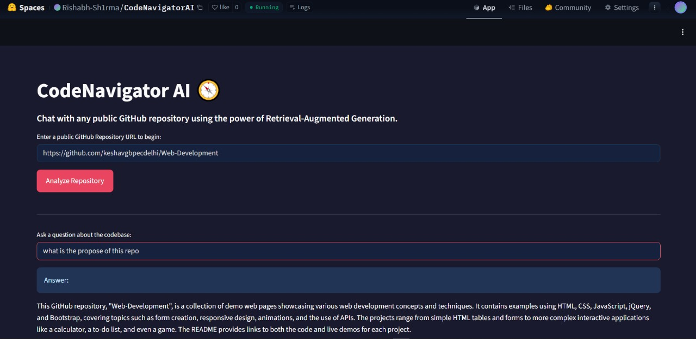
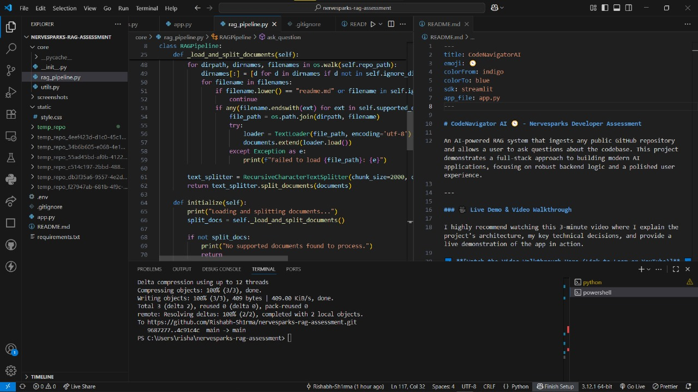

# CodeNavigator AI 🧭 - Nervesparks Developer Assessment

An AI-powered RAG system that ingests any public GitHub repository and allows a user to ask questions about the codebase. This project demonstrates a full-stack approach to building modern AI applications, focusing on robust backend logic and a polished user experience.

---

### 🎥 Live Demo & Video Walkthrough

I highly recommend watching this 3-minute video where I explain the project's architecture, my key technical decisions, and provide a live demonstration of the app in action.

➡️ **[Watch the Video Walkthrough Here (Link to Loom or YouTube)]** ⬅️

Or, you can interact with the live, deployed application yourself:

🚀 **[Try the Live Application Here (Link to Deployed App)]** 🚀

---

### ✨ Key Features

-   **Dynamic GitHub Repository Ingestion:** Accepts any public GitHub repository URL as a data source.
-   **Intelligent Document Processing:** Automatically parses relevant source code and documentation while smartly ignoring noisy files (like `package-lock.json`) and directories (`node_modules`).
-   **Prioritized Context with README:** Always uses the `README.md` as the primary context for high-level questions, leading to more accurate and relevant summaries.
-   **Context-Aware Q&A:** Leverages a Retrieval-Augmented Generation (RAG) pipeline with **Google's Gemini 1.5 Flash** model to answer questions with high technical accuracy.
-   **Polished Custom UI:** A professional and responsive user interface built with Streamlit and custom CSS.

---

### 📸 Screenshots

Here are a couple of screenshots of the application in action.

*(**Instructions:** Take 1-2 screenshots of your app, add them to a new `screenshots` folder in your project, and update the paths below.)*


*A view of the main user interface.*


*An example of the RAG system providing an accurate answer.*

---

### ⚙️ Tech Stack & Architecture

I chose a modern stack designed for rapid development and robust performance.

-   **Core RAG Framework:** **LangChain**
    -   *Justification:* Chosen for its comprehensive ecosystem that simplifies the integration of LLMs, document loaders, and vector stores.
-   **Embeddings & LLM:** **Google Gemini** (`models/embedding-001`, `gemini-1.5-flash-latest`)
    -   *Justification:* Selected for its state-of-the-art performance, large context window, and speed, making it ideal for this Q&A task.
-   **Vector Database:** **ChromaDB**
    -   *Justification:* Used for its simplicity and efficiency as an in-memory vector store, perfect for this assignment's scope.
-   **UI & Deployment:** **Streamlit & Hugging Face Spaces**
    -   *Justification:* Chosen for the ability to rapidly build a functional UI in Python and deploy it with a public URL, free of charge.

---

### 🚀 My Credentials & Portfolio

-   **LinkedIn:** `https://www.linkedin.com/in/rishabh-sharma25/`
-   **Portfolio:** `https://marvelous-presentations-488852.framer.app/`
-   **GitHub:** `https://github.com/Rishabh-Sh1rma`
-   **Email:** `rishabhar1974@gmail.com`

---

### 💡 More of My Work (Proof of Work)

Here are a couple of other projects that demonstrate my skills in AI and development.

-   **Project 1: Retrieval-Augmented-Generation--QA-ChatBot**
    -   *Description:* A chatbot that answers questions from documents using a RAG pipeline with FastAPI, FAISS, and React.
    -   *Link:* `https://github.com/Rishabh-Sh1rma/Retrieval-Augmented-Generation--QA-ChatBot`

-   **Project 2: Portfolio Analytics Dashboard**
    -   *Description:* A data analytics dashboard for visualizing portfolio metrics.
    -   *Link:* `https://github.com/Rishabh-Sh1rma/portfolio-analytics-dashboard`

---

### 🛠️ How to Run Locally

1.  **Clone the repository:**
    ```bash
    git clone [https://github.com/Rishabh-Sh1rma/nervesparks-rag-assessment.git](https://github.com/Rishabh-Sh1rma/nervesparks-rag-assessment.git)
    cd nervesparks-rag-assessment
    ```
2.  **Set up a virtual environment and activate it:**
    ```bash
    python -m venv venv
    .\venv\Scripts\Activate.ps1
    ```
3.  **Install dependencies:**
    ```bash
    pip install -r requirements.txt
    ```
4.  **Set up your environment variables:**
    -   Create a file named `.env` in the root directory.
    -   Add your Google API key: `GOOGLE_API_KEY="AIzaSy..."`
5.  **Run the application:**
    ```bash
    streamlit run app.py
    ```